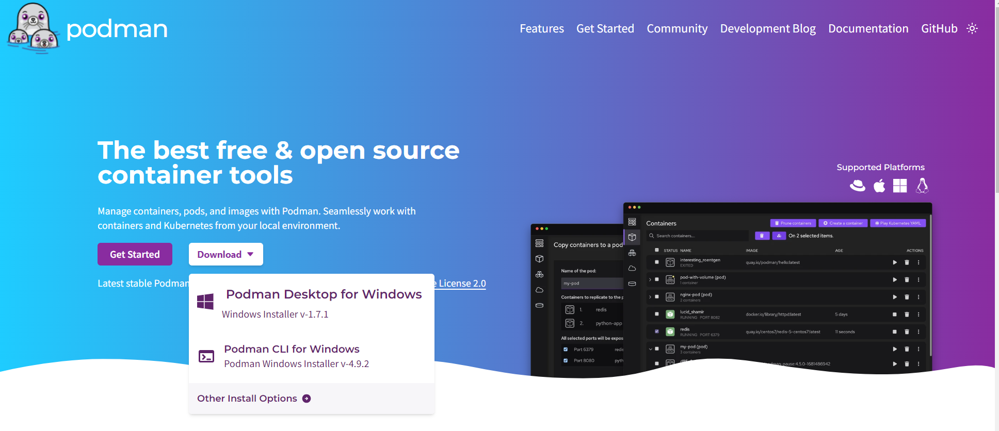

# Part 1

Start med å innstallere podman på maskinen din om du ikke har det fra før. Gå til 'https://podman.io/' for å laste ned og innstallere.

Etter instllasjon må du kjøre følgende kommandoer i powershell e.l.

`podman machine init`

`podman machine start`

For å sjekke at alt er på plass og virker, kan du prøve:

`podman info`

## Enkel oppgave å starte docker/podman reisen med. Python med Flask i container.

 `cd PythonMedFlask`

 `podman build . --tag hello_bouvet`

 `podman run --rm -p 127.0.0.1:8000:8000 hello_bouvet`

Bytt ut 'hello_bouvet' med hva du ønsker å kalle container image du lager.

Test containeren ved å åpne nettleser og gå til 'http://127.0.0.1:8000/' for å se en liten beskjed. 

`Ctrl + C` (Windows)/`Cmd + C` (Mac) for å avslutte container. Bruk ikke localhost i stedet for 127.0.0.1, du kan jo prøve for å se resultatet.

## En enkelt utvikler container for Rust utvikling.

Hvis man f.eks ønsker en separat container for utvikling av programvare i Rust eller et annent språk, kan man enkelt lage en container basert på offisielle imager.

`cd RustUtviklerContainer`

`podman build . --tag rusty_dev`

`podman run -it --rm rusty_dev`

Da er man inne i containeren. Sjekke ved å se på hash value i kommando linjen og kjør 'pwd' for å se hvilken path du er i inne i containeren.

`cargo new --name hello hello_app`

`cd hello_app`

`cargo build`

`cargo run`

Da ser du programmet i Rust bygget og kjørt inne i containeren. Med `-rm` flagget mister man alt inne i containeren om du ikke bruker volume for persistant storage. Man kan jo pushe til git e.l. i stedet om det er ønskelig og alltid starte med et rent utvikler miljø hver gang man starter containeren.

`exit`

Bringer deg ut av container som avslutter og du mister all data.

## IoT Utvikling for ARM prosessor baserte prosjekter i en container.

La oss si at du ønsker å utvikle programvare for en mikrokontroller, mobil telefon e.l. som benytter seg av en annen prosessor type en utvikler maskinen din. Arm i stedet for Intel/AMD. Da kan man lage en container som har kryss kompilerings programmer som ikke er avhengig eller påvirker din egen maskin. La oss bygge en slik og lage et enkelt hello program for arm prosessorer.

`podman build -t stenbror/iot .`

Dette tar litt tid, da det lastes ned kryss kompilatorer for kryss kompilering og vi setter opp et Ubuntu system for dette.

 `podman run -it stenbror/iot`

 Da er vi inne i containeren og i katalogen for prosjektet vi ønsker å bygge.

 `./build.sh`

 Lager et program som kan kjøres på en arm basert maskin. Prøv å kjør den her og du ser den ikke er av Intel/AMD typen og lar seg ikke kjøre, men på en arm basert maskin vil den fungere. Eks. Raspberry Pi e.l.

## Presentasjonen er tilgjengelig.

[Link](https://bouvetasa.sharepoint.com/:p:/s/OstDSFaggruppeBackend/EQiDIA2TvY1Ouw4-nO50ewUBsMMbtoKddyl57glYvajbEA?e=inDSem) til presentasjon
